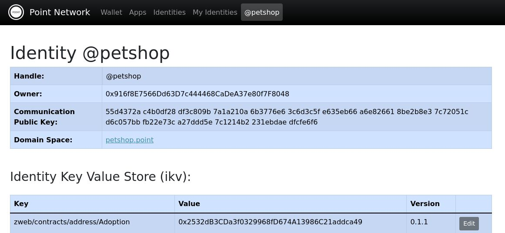

# Pet Shop

This app was adapted from Pet Shop tutorial from Truffle (https://trufflesuite.com/guides/pet-shop/) to be deployed in Point Network.

The adjustments performed were the creation of point.deploy.json file and also routes.json, which are necessary for Point Network DApps.

## Deploying the application

There are two ways to deploy the Pet Shop to Point Network:


### (1) Deploy the contracts using Truffle and files using Point Deployer.

You first need to configure the Point Network that you wish to deploy in the truffle config file as shown bellow:

```
networks: {
    point: {
        host: "https://rpc-mainnet-1.point.space/",
        port: 80,
        network_id: "*", // Match any network id
        gasPrice: 7,
    }
}
```

Now you can deploy your contracts, as usual, using truffle:

`truffle migrate --network point`

After that, copy the address of the deployed contracts to the configuration of point.deploy.json. To perform that, the following configuration should be present in the point.deploy.json:

```
...
"useIDE": {
    "name": "truffle",
    "projectDir": ".",
    "addresses": {
        "Adoption": "0x3B16546197cdB14d13bB5DfCdb73299EF03D8401" //change this address to the deployed contract
    }
}
...
```

Also, copy the ABI of the contracts (in case Adoption.json) from the folder build/contracts to the public folder.


Use the point deploy command to deploy your files to Point Network. Run the following command from the root folder of the application.

`point deploy`

After that, the application should be available in Point Network under the target configured in the point.deploy.json file. You need to have access (be the owner or deployer) to the identity to be able to deploy to it.   

---


### (2) Deploy the contracts and files using point deployer and update manually the address in the ABI.

For using this option you must delete the useIDE configuration option in point.deploy.json of the application.

Deploy the application and contracts using point-deploy command. Run the following command from the root folder of the application.

`point deploy`

In the end of the contract ABI file (build/contracts/Adoption.json), there is a network section, which maps the id of the network to the address of the contract. See the code bellow.

```
  "networks": {
    "256": {
      "events": {},
      "links": {},
      "address": "0x2532dB3CDa3f0329968fD674A13986C21addca49",
      "transactionHash": "0x24d9736473db6660076539133b81811a188e9a221fb41284685ea63b8804b69c"
    },
```

Go to the explorer page of the application deployed and get the address of the contract, in case Adoption. Update the address of the contract in the network used to deploy. 



Copy the ABI file (build/contracts/Adoption.json) to the public folder and deploy the application again using point deployer.

`point deploy`

After that, the application should be available in Point Network under the target configured in the point.deploy.json file. You need to have access (be the owner or deployer) to the identity to be able to deploy to it.   

---

